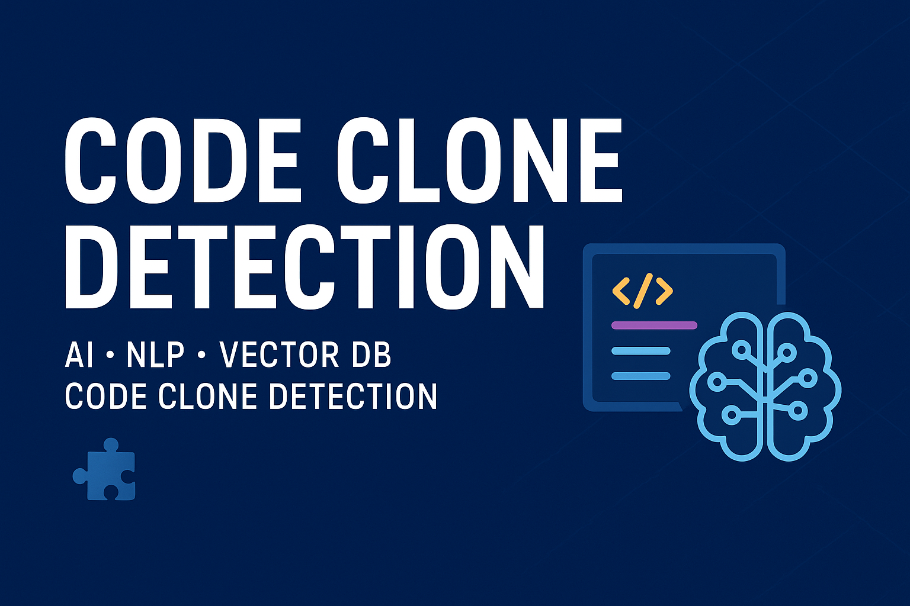

# Code-clone-detection-A-vector-database-based-approach-for-type-3-and-type-4-of-code-clones
This project formed the core of my final engineering thesis.

# 🧩 Code Clone Detection

  

  
  
  
  

---

## 📌 Overview
This project focuses on **semantic code clone detection (Type-4)** using **NLP embeddings** and **vector databases**.  
Instead of relying on syntax or structure, the system learns **semantic representations** of code and uses **vector similarity search** to detect clones across large-scale datasets.  

---

## 🚀 Features
- 📂 **Data Pipeline** – Cleans and normalizes millions of code functions.  
- 🔎 **Semantic Embeddings** – Uses **Sentence Transformers** for multilingual code understanding.  
- ⚡ **Vector Search** – Powered by **Qdrant** for efficient nearest-neighbor queries.  
- 📊 **Evaluation** – Accuracy, precision, recall, and scalability metrics.  
- 🌍 **Multi-dataset Support** – Works with **POJ104, BigCloneBench, Google Code Jam, and CodeNet**.  

---

## 📂 Datasets
Supported datasets include:  
- **POJ104** → C programs for classification.  
- **BigCloneBench** → Java clone pairs (Type-1 to Type-4).  
- **Google Code Jam** → Competitive programming solutions (multi-language).  
- **CodeNet** → 14M code samples in 55 languages.  

---

## 🛠️ Tech Stack
- **Languages**: Python  
- **Libraries**: PyTorch, Sentence Transformers, Pandas, NumPy, Scikit-learn  
- **Database**: Qdrant  
- **Tools**: Hugging Face, Jupyter, VSCode  

---

## 📊 Research Goals
- ✅ Compare **embedding + vector DB** vs. **neural models** for clone detection.  
- ✅ Measure **accuracy, recall, and precision**.  
- ✅ Test **scalability** on multilingual, large datasets.  
- ✅ Analyze **computational efficiency & memory usage**.  

---

